# 1. Web 관련 이론(면접 질문 단골들!)

## 1-1. HTTP

- HyperText Transfer Protocol, 웹 상에서 컨텐츠를 전송하기 위한 약속
- **클라이언트-서버 프로토콜**이라고도 부르며, **요청(->)**과 **응답(<-)**으로 통신된다.
- Stateless(무상태)이기 때문에 응답을 마치고 연결을 끊는 순간 상태 정보가 유지되지 않음.
  - 쿠키와 세션을 사용해서 서버 상태를 요청과 연결하도록 함

## 1-2. HTTP Request Methods

- 리소스에 대해 수행할 원하는 작업을 나타내는 메서드
- 대표적인 HTTP Request Methods
  - GET : 서버에 리소스의 표현을 요청, 데이터만 검색해야 함
  - POST : 데이터를 지정된 리소스에 제출, 서버의 상태를 변경
  - PUT : 요청한 주소의 리소스를 수정
  - DELETE : 지정된 리소스를 삭제
- HTTP response status codes : 특정 HTTP 요청이 성공적으로 완료되었는가의 여부
  - 100번대 : Informational responses
  - 200번대 : Successful responses
  - 300번대 : Redirection responses
  - 400번대 : Client error responses
  - 500번대 : Server error responses

## 1-3. URI와 URL, URN

|                  |        URI         |  =   |      URL       |  or  |        URN        |
| :--------------: | :----------------: | :--: | :------------: | :--: | :---------------: |
|    약자 구분     | Identifier(식별자) |      | Location(주소) |      | Name(독립적 이름) |
| 리소스 식별 방법 |                    |      |  자원의 위치   |      |    고유한 이름    |

- URI : Uniform Resource Identifier, 통합 자원 식별자
  - HTTP 요청의 대상을 resourse(자원)이라고 하며, 이 자원들을 URI로 식별함
  - 이 리소스는 HTML, CSS, 이미지 등이 될 수 있음
- URL : 웹에서 주어진 리소스의 주소(.com만 일부러 띄웠음)
  - **Scheme + Authority (+ Path + Parameters + Anchor)**
  - https :// www.example. com :80 /path/to/myfile.html/ ?key=value #quick-start
  - Scheme (or Protocol) - https 부분
    - 브라우저가 어떤 규약을 사용하는지를 나타냄
  - Authority (Domain Name + Port) - :// 구분 후 www.example .com :80 부분
    - Domain Name - 요청 중인 웹 서버를 나타냄.
    - Port - : 뒤의 숫자 부분을 말하며 리소스에 접근하는데 필요한 기술적인 문, 표준 포트는 HTTP가 80, HTTPS가 443이며 **오직 이 표준 포트일 때만 생략 가능**
  - Path - /path/to/myfile.html/ 부분
    - 웹 서버의 리소스 경로
    - 초기에는 실제 파일의 물리적 위치였지만, 오늘날에는 추상화된 형태의 구조로 표현
  - Parameters - ? 이후 key=value 부분
    - 웹 서버에 제공하는 추가적인 데이터(예시 : 검색 엔진의 검색 정보)
    - 여러 개의 key-value 쌍이 들어갈 경우 사이에 \& 기호로 구분함
  - Anchor - # 이후 quick-start 부분
    - 리소스의 다른 부분에 대한 앵커, 리소스 내부의 일종의 '북마크'를 나타냄
    - 이 부분은 서버에 전송되지 않고, 브라우저에서 앵커가 정의한 지점으로 스크롤 한다던가 하는 동작을 수행함
- URN : 자원의 위치에 영향 받지 않는 독립적 이름
  - ISBN(도서 번호)처럼 이름만으로 자원을 식별함
  - 이 방법은 보편화되지 않아 현재는 대부분 URL 사용

## 1-4. REST API

- API(application Programming Interface)
  - 앱과 프로그래밍으로 소통하는 방법, API를 제공하는 애플리케이션과 다른 소프트 or 하드웨어 등의 사이의 간단한 계약(인터페이스)라고 볼 수 있음
  - 복잡한 코드를 추상화하여 대신 사용 가능한 더 쉬운 구문을 제공함
  - API는 JSON, HTML, XML 등 다양한 타입의 데이터를 응답함
  - 현재 Web API는 여러 Open API를 사용하는 추세 (Youtube, Naver Papago, ...)

- REST(REpresentational State Transfer)
  - **REST는 자원을 정의하고 자원에 대한 주소를 지정하는 전반적인 방법을 뜻하며, 이 원리를 따르는 시스템을 RESTful하다고 부름**
  - API 서버를 개발하기 위한 일종의 소프트웨어 설계 방법론
    - 자원의 식별 - URI (URL or URN)
    - 자원의 행위 - HTTP Method
    - 자원의 표현 - JSON, 자원과 행위를 통해 궁극적으로 표현되는 결과물
  - RESTful한 API를 만들려면?
    - URL로는 데이터만 전송
    - HTML Method에서 CRUD 과정을 모두 처리 (GET, POST, PUT, DELETE)
    - 응답은 JSON으로 받을 예정
  - JSON?
    - JavaScript의 표기법을 따른 그냥 문자열
    - 다양한 자료구조로 쉽게 변환 가능한 key-value 형태 구조로 현재 API에서 가장 많이 사용

## 1-5. Serialization(직렬화)

- 데이터 구조나 객체 상태를 어떠한 언어나 환경에서도 **나중에 다시 쉽게 사용할 수 있는 포맷으로 변환**하는 과정
- JSON 형식이 가장 보편적으로 쓰임
- Django의 serialize()는 Queryset이나 Model Instance 등 복잡한 데이터를 Python 데이터 타입으로 만들어 주어서, JSON 등의 유형으로 쉽게 변환할 수 있게 함

# 2. JSON 데이터 응답 모델 예시 살펴보기

## 2-1. 사전 준비

- 시작하기에 앞서
  - 지금까지 Django로 작성한 서버는 html로만 응답하고 있었지만, 사실 다양한 데이터 타입으로 응답할 수 있음. 그래서 html 대신 **JSON으로 응답하는 서버**로 바꿔볼 것임
  - **사용자에게 보여주는 것은 Front-end Framework가 담당할 예정 (->Vue.js)**
  - **이제 Django를 Back-end로만 사용할 것이며, 따라서 Template 부분은 담당하지 않음**

- 먼저 준비된 01_json_response 프로젝트를 실행하여 가상 환경, pip 설치 등의 과정 진행

  - git 파일을 이전 버전으로 되돌려야 하므로 bash에서 git reset --hard ddae 입력
  - 완성본으로 되돌리려면 git reset --hard 6dbc

- migrate를 진행하고 준비된 fixtures 파일을 load하여 실습용 데이터 입력

  - python manage.py loaddata articles.json

- 미리 작성된 urls.py 파일 확인

  ```python
  # my_api/urls.py
  from django.contrib import admin
  from django.urls import path, include
  
  urlpatterns = [
      path('admin/', admin.site.urls),
      path('api/v1/', include('articles.urls')),
  ]
  ```

  ```python
  # articles/urls.py
  from django.urls import path
  from . import views
  
  urlpatterns = [
      path('html/', views.article_html),
      path('json-1/', views.article_json_1),
      path('json-2/', views.article_json_2),
      path('json-3/', views.article_json_3),
  ]
  ```

## 2-2. HTML 응답

- HTML 문서 한 장을 응답하는 서버 확인(지금까지 Django로 응답해오던 방식, url-view-templates)

  ```python
  # articles/views.py
  from django.shortcuts import render
  from .models import Article
  
  def article_html(request):
      articles = Article.objects.all()
      context = {
          'articles': articles,
      }
      return render(request, 'articles/article.html', context)
  ```

  ```django
  <!-- articles/templates/articles/article.html -->'
  <!DOCTYPE html>
  <html lang="en">
  <head>
    <meta charset="UTF-8">
    <meta http-equiv="X-UA-Compatible" content="IE=edge">
    <meta name="viewport" content="width=device-width, initial-scale=1.0">
    <title>Document</title>
  </head>
  <body>
    <h1>Article List</h1>
    <hr>
    <p>
      
        <h2>{{ article.pk }}번 글. {{ article.title }}</h2>
        <p>{{ article.content }}</p>
        <hr>
      
    </p>
  </body>
  </html>
  ```

- 서버를 열어서 /api/v1/html/로 접속하면 DB에 저장된 글들을 HTML 형태로 볼 수 있음

  - 'Content-Type' entity header : 응답 내의 컨텐츠의 컨텐츠 유형이 뭔지 클라이언트에게 알려줌
  - 이 예시의 경우 text/html로 표시됨

  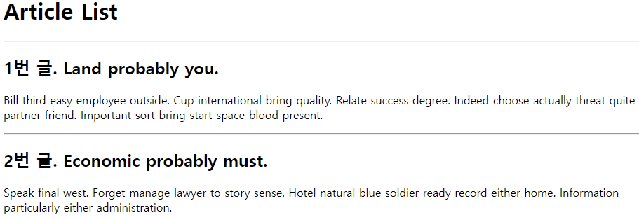

## 2-3. JsonResponse()를 이용한 JSON 응답

- 이제 HTML 문서는 클라이언트에서 제공하고 있다고 생각하고, 백엔드에서 JSON 데이터만 처리해볼까?

- JsonResponse()란?

  - Python 데이터를 바탕으로 JSON으로 변환된 응답을 만드는 클래스
  - safe 파라미터 : True는 dict 인스턴스만 허용(기본 상태), False로 설정하면 모든 타입의 객체를 serialization 할 수 있음

- 이제까지 Templates(.html)에 있던 for문을 view로 옮겨온 것과 유사함.

  - 이전 : view에서 일단 보냄 -> templates에서 하나씩 출력
  - 현재 : view에서 하나씩 묶어서 정리 -> 정리된 것을 JSON 형식으로 보냄

  ```python
  # articles/views.py
  from django.http.response import JsonResponse
  
  def article_json_1(request):
      articles = Article.objects.all()
      articles_json = []
  
      for article in articles:
          articles_json.append(
              {
                  'id': article.pk,
                  'title': article.title,
                  'content': article.content,
                  'created_at': article.created_at,
                  'updated_at': article.updated_at,
              }
          )
      return JsonResponse(articles_json, safe=False)
  ```

- 서버를 열어서 /api/v1/json-1/로 접속하면 결과물을 JSON 형태로 볼 수 있음 (JSON Viewer 필요)

  - Content-type은 application/json으로 표시됨

  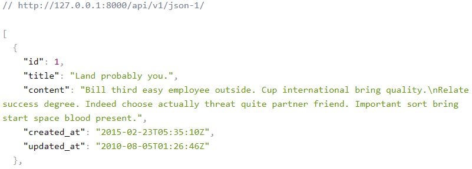

## 2-4. Django Serializer를 이용한 JSON 응답

- Django의 내장 HttpResponse()를 활용한 JSON 응답

  - 이제 JSON의 모든 필드를 굳이 전부 작성해서 일일이 append할 필요가 없음!

  ```python
  # articles/views.py
  from django.http.response import JsonResponse, HttpResponse # HttpResponse가 추가됨
  from django.core import serializers
  
  def article_json_2(request):
      articles = Article.objects.all()
      data = serializers.serialize('json', articles)
      return HttpResponse(data, content_type='application/json')
  ```

- /api/v1/json-2/로 접속

  - model이 추가로 표시, id 대신 pk로 표시되며, Content-Type은 application/json으로 동일

  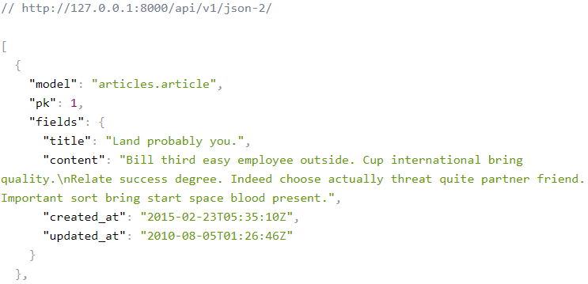

## 2-5. Django REST Framework를 사용한 JSON 응답

- (약자로) DRF란?

  - Django에서 Restful API 서버를 쉽게 구축할 수 있도록 도와주는 오픈소스 라이브러리

  - DRF의 serializer는 Django의 Form 및 ModelForm 클래스와 유사하게 작동

- 먼저 DRF가 설치된 것을 확인

  ```python
  # settings.py
  INSTALLED_APPS = [
      'articles',
      'rest_framework',
  	...
  ]
  ```

- ModelForm과 유사한 ModelSerializer 구조 및 사용법 확인

  ```python
  # articles/serializers.py
  from rest_framework import serializers
  from .models import Article
  
  class ArticleSerializer(serializers.ModelSerializer):
  
      class Meta:
          model = Article
          fields = '__all__'
  ```

  ```python
  # articles/views.py
  # @api_view(['GET'])
  @api_view()
  def article_json_3(request):
      articles = Article.objects.all()
      serializer = ArticleSerializer(articles, many=True)
      return Response(serializer.data)
  ```

- /api/v1/json-3/으로 접속

  - JSON 데이터를 DRF 전용 템플릿으로 응답함, Content-Type은 text/html로 표시됨

  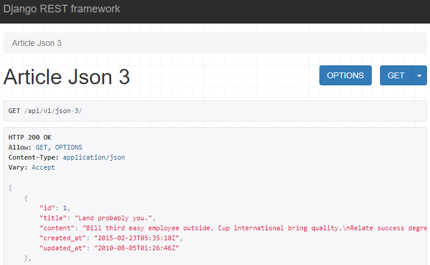

## 2-6. 직접 requests 라이브러리를 사용하여 json 응답 받아보기

- requests 라이브러리 설치 -> pip install requests

- gogo.py 파일 확인

  ```python
  # gogo.py
  import requests
  from pprint import pprint
  
  response = requests.get('http://127.0.0.1:8000/api/v1/json-3/')
  result = response.json()
  
  # pprint(result)
  # pprint(result[0])
  pprint(result[0].get('title'))
  ```

- 터미널 화면을 분할하여 Django 서버를 켜둔 상태로 gogo.py를 실행하면...?

  - 터미널 창에 JSON 파일에서 요청한 부분만 출력된다!

# 3. Django REST Framework - 싱글 모델

- 단일 모델 데이터를 Serialization하여 JSON으로 변환하는 방법 학습
- 게시판의 게시글 CRUD 구현
- 작성시 va**il**d나, url 끝의 /나, _와 .의 구분 등에 특히 유의!!!

## 3-1. 사전 준비

- Postman 설치

  - API를 구축하고 사용하기 위한 플랫폼
  - 현재까지 HTML에서 일일이 클릭하고 입력하던 것을 JSON 데이터 형식으로 대체
  - 웹페이지 출력, 입력 대신 주소 자체를 Postman에 입력해 넣으면 됨

  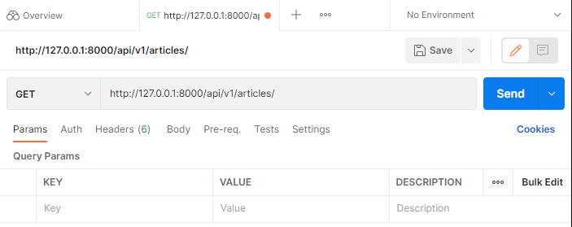

- 준비된 02_drf 프로젝트를 실행하여 가상 환경, pip 설치 등의 과정 진행

- Article 모델을 주석 해제 후 migrate

  ```python
  # articles/models.py
  class Article(models.Model):
      title = models.CharField(max_length=100)
      content = models.TextField()
      created_at = models.DateTimeField(auto_now_add=True)
      updated_at = models.DateTimeField(auto_now=True)
  ```

- 준비된 fixtures 데이터를 load

  - python manage.py loaddata articles.json

- DRF를 설치하고 등록 후, 패키지 목록을 업데이트

  - pip install djangorestframework
  - pip freeze > requirements.txt

  ```python
  # my_api/settings.py
  
  INSTALLED_APPS = [
      'articles',
      'django_extensions',
      'rest_framework',
  	...
  ]
  ```

## 3-2. ModelSerializer 작성

- ModelSerializer 클래스란?

  - 모델 필드에 해당하는 필드가 있는 Serializer 클래스를 자동으로 만들 수 있는 숏컷을 제공
  - Model 정보에 맞춰 자동으로 필드 생성, Serializer에 대한 유효성 검사기를 자동으로 생성
  - .create(), .update()의 간단한 기본 구현이 포함됨

- articles/serializers.py(위치나 파일명은 상관 X)를 생성하고 ModelSerializer 작성

  ```python
  #articles/serializers.py
  from rest_framework import serializers
  from .models import Article, Comment
  
  class ArticleListSerializer(serializers.ModelSerializer):
  
      class Meta:
          model = Article
          fields = ('id', 'title', 'content',)
  ```

## 3-3. Serializer 사용법 연습

- 터미널을 열고 다음과 같이 입력

  ```python
  python manage.py shell_plus
  >>> from articles.serializers import ArticleListSerializer
  ```

- 인스턴스 구조 확인

  ```python
  >>> serializer = ArticleListSerializer()
  
  >>> serializer
  ArticleListSerializer():
      id = IntegerField(label='ID', read_only=True)
      title = CharField(max_length=100)
      content = CharField(style={'base_template': 'textarea.html'})
  ```

- Model instance 객체 serialize 후 조회

  ```python
  >>> article = Article.objects.get(pk=1)
  >>> serializer = ArticleListSerializer(article)
  
  >>> serializer
  ArticleListSerializer(<Article: Article object (1)>):
      id = IntegerField(label='ID', read_only=True)
      title = CharField(max_length=100)
      content = CharField(style={'base_template': 'textarea.html'})
      
  >>> serializer.data
  {'id': 1, 'title': 'Hair each base dark guess garden accept.', 'content': 'Religious ball another laugh light million. Federal public power another.\nDuring always recent maintain major others bank. Say place address. Wife tough outside system must. Develop road especially.'}
  ```

- QuerySet 객체 serialize

  ```python
  >>> articles = Article.objects.all()
  ```

  - many=True 옵션이 없을 경우

  ```python
  >>> serializer = ArticleListSerializer(articles)
  >>> serializer.data
  ...
  AttributeError: Got AttributeError when attempting to get a value for field `title` on serializer `ArticleListSerializer`.
  The serializer field might be named incorrectly and not match any attribute or key on the `QuerySet` instance.
  Original exception text was: 'QuerySet' object has no attribute 'title'.
  ```

  - many=True 옵션을 넣을 경우(단일 객체 인스턴스 대신 QuerySet이나 객체 목록을 Serialize할 때 필요)

  ```python
  >>> serializer = ArticleListSerializer(articles,many=True)
  >>> serializer.data
  [OrderedDict([('id', 1), ('title', 'Hair each base dark guess garden accept.'), ('content', 'Religious ball another laugh light million. Federal public power another.\nDuring always recent maintain major others bank. Say place address. Wife tough outside system must. Develop road especially.')]), OrderedDict([('id', 2), ('title', 'Sit sign share you.'), ('content', 'Call authority choose discuss yes. Experience century Mrs population company couple million.\nCareer challenge response many throw. Because practice what a allow its consumer.')]), ...
  ```

## 3-4. RESTful API를 따르는 CRUD 만들기

- URL과 HTTP requests methods 설계

  |             |     GET      |  POST   |     PUT      |    DELETE    |
  | :---------: | :----------: | :-----: | :----------: | :----------: |
  |  articles/  | 전체 글 조회 | 글 작성 | 전체 글 수정 | 전체 글 삭제 |
  | articles/1/ | 1번 글 조회  |    X    | 1번 글 수정  | 1번 글 삭제  |

  

- GET - List(게시글 데이터 목록 조회)

  - DRF에서 @api_view 데코레이터는 필수 (DRF view 함수가 응답해야 하는 HTTP 메서드 목록을 받으며, GET만 허용되고 다른 메서드 요청은 405 Method Not Allowed로 응답)

  ```python
  # articles/urls.py
  from django.urls import path
  from . import views
  
  urlpatterns = [
      path('articles/',views.article_list),
  ]
  ```

  ```python
  # articles/views.py
  from rest_framework.response import Response
  from rest_framework.decorators import api_view
  
  from .models import Article
  from .serializers import ArticleListSerializer
  
  @api_view(['GET'])
  def article_list(request):
      articles = Article.objects.all()
      serializer = ArticleListSerializer(articles, many=True)
      return Response(serializer.data)
  ```

  - /api/v1/articles/ 응답 확인

  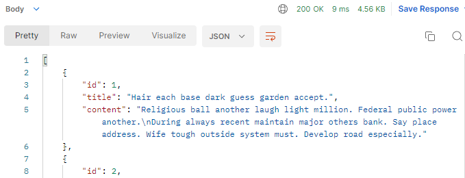

- GET - Detail(단일 게시글 데이터 조회)

  - 각 데이터의 상세 정보를 제공하는 ArticleSerializer 정의

  ```python
  # articles/serializers.py
  class ArticleSerializer(serializers.ModelSerializer):
      class Meta:
          model = Article
          fields = '__all__'
  ```

  - url, view 함수 작성

  ```python
  # articles/urls.py
  urlpatterns = [
      ...
      path('articles/<int:article_pk/>',views.article_detail),
  ]
  ```

  ```python
  # articles/views.py
  @api_view(['GET'])
  def article_detail(request):
      article = Article.objects.get(pk=article.pk)
      serializer = ArticleSerializer(article)
      return Response(serializer.data)
  ```

  - /api/v1/articles/1/ 응답 확인

  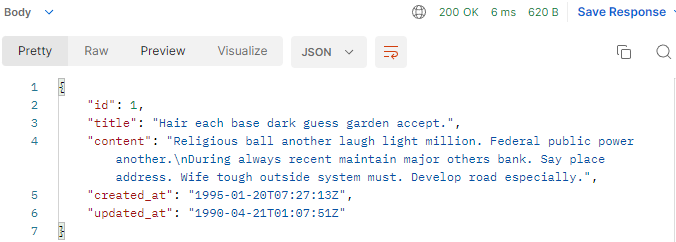

- POST - 게시글 데이터 생성하기

  - 요청에 대한 데이터 생성이 성공할 경우 201 Created, 실패할 경우 400 Bad request 응답

  ```python
  # articles/views.py
  ...
  from rest_framework import status
  ...
  
  # 기존 내용을 if문 안으로 넣고 POST 부분을 추가함
  @api_view(['GET', 'POST'])
  def article_list(request):
      if request.method == 'GET':
          articles = Article.objects.all()
          serializer = ArticleListSerializer(articles, many=True)
          return Response(serializer.data)
      elif request.method == 'POST':
          serializer = ArticleSerializer(data=request.data)
          if serializer.is_valid():
              serializer.save()
              return Response(serializer.data, status=status.HTTP_201_CREATED)
          return Response(serializer.errors, status=status.HTTP_400_BAD_REQUEST)
  ...
  ```

  - POSTMAN으로 요청 보내보기. 설정을 이것저것 건드릴 게 많으니 조심할 것!

    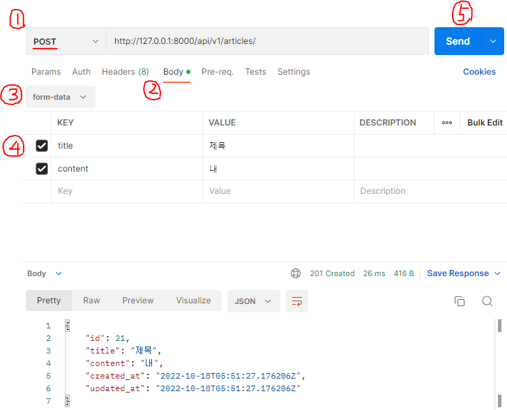

  - GET으로 .../21 로 접속하면 데이터를 읽을 수 있음!
  - is_valid()는 유효하지 않은 데이터에 대해 ValidationError 예외를 발생시키는 raise_exception 인자를 사용 가능하고 기본적으로 HTTP 400 응답을 반환함 -> 관련 내용 추가

  ```python
  # articles/views.py
  ...
  @api_view(['GET', 'POST'])
  def article_list(request):
      ...
      elif request.method == 'POST':
          serializer = ArticleSerializer(data=request.data)
          # 이 곳에 추가됨
          if serializer.is_valid(raise_exception=True):
            ...
  ```

- DELETE - 게시글 데이터 삭제하기

  - 데이터 삭제를 완료한 경우 더 이상 제공할 정보가 없으므로 204 No Content 상태를 응답

  ```python
  # articles/views.py
  ...
  @api_view(['GET', 'DELETE'])
  def article_detail(request, article_pk):
      article = Article.objects.get(pk=article_pk)
      if request.method == 'GET':
          serializer = ArticleSerializer(article)
          return Response(serializer.data)
      elif request.method == 'DELETE':
          article.delete()
          return Response(status=status.HTTP_204_NO_CONTENT)
  ```

  - DELETE 후 /api/v1/articles/21 응답 확인

    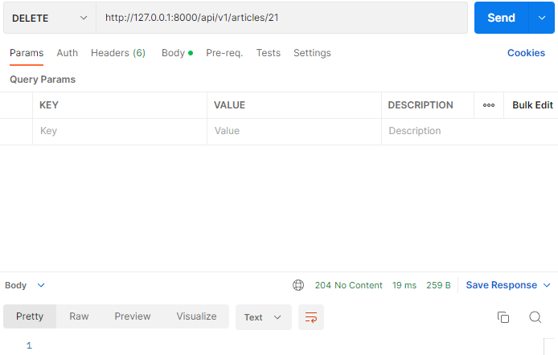

- PUT - 게시글 데이터 수정하기

  - 데이터 수정이 성공할 경우 200 OK 상태 코드 응답

  ```python
  @api_view(['GET', 'DELETE', 'PUT'])
  def article_detail(request, article_pk):
      ...
      elif request.method == 'PUT':
          serializer = ArticleSerializer(article, data=request.data)
          if serializer.is_valid(raise_exception=True):
              serializer.save()
              return Response(serializer.data)
  ```

  - PUT /api/v1/articles/1 응답 확인

    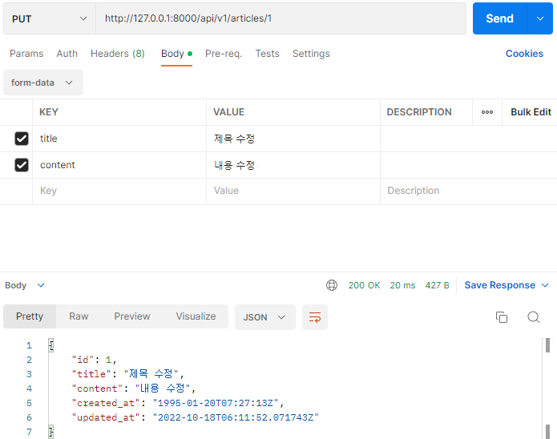

# 4. Django REST Framework - N : 1 모델

- N : 1 관계에서의 모델 data를 Serialization하여 JSON으로 변환
- 게시글의 댓글 CRUD 구현

## 4-1. 사전 준비

- Comment 모델 주석 ~~봉인~~ 해제 후 DB 초기화, 다시 migration 진행

  ```python
  # articles/models.py
  class Comment(models.Model):
      article = models.ForeignKey(Article, on_delete=models.CASCADE)
      content = models.TextField()
      created_at = models.DateTimeField(auto_now_add=True)
      updated_at = models.DateTimeField(auto_now=True)
  ```

- 준비된 fixtures 데이터 load

  - python manage.py loaddata articles.json comments.json

## 4-2. CRUD 만들기

- GET - List(댓글 데이터 목록 조회하기)

  ```python
  # articles/serializers.py
  class CommentSerializer(serializers.ModelSerializer):
      class Meta:
          model = Comment
          fields = '__all__'
  ```

  ```python
  # articles/urls.py
  urlpatterns = [
      ...
      path('comments/', views.comment_list),
  ]
  ```

  ```python
  # articles/views.py
  ...
  from .models import Article, Comment
  from .serializers import ArticleListSerializer, ArticleSerializer, CommentSerializer
  ...
  @api_view(['GET'])
  def comment_list(request):
      comments = Comment.objects.all()
      serializer = CommentSerializer(comments, many=True)
      return Response(serializer.data)
  ```

  - GET /api/v1/comments/ 응답 확인

    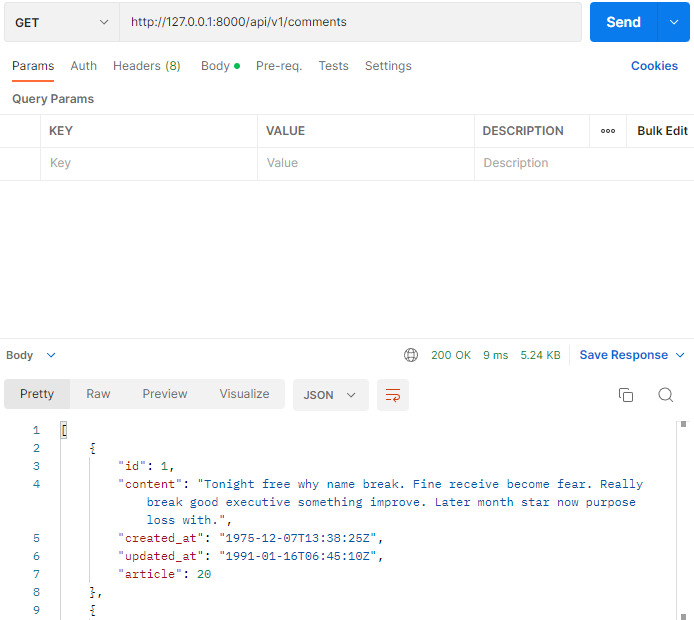

- GET - Detail(단일 댓글 데이터 조회하기)

  - Article과는 다르게, Serializer를 같은 것으로 공유한다.

  ```python
  # articles/urls.py
  ...
  urlpatterns = [
      ...
      path('comments/', views.comment_list),
      path('comments/<int:comment_pk>/', views.comment_detail),
  ]
  ```

  ```python
  # articles/views.py
  ...
  @api_view(['GET'])
  def comment_detail(request, comment_pk):
      comment = Comment.objects.get(pk=comment_pk)
      serializer = CommentSerializer(comment)
      return Response(serializer.data)
  ```

  - GET /api/v1/comments/1/ 응답 확인

    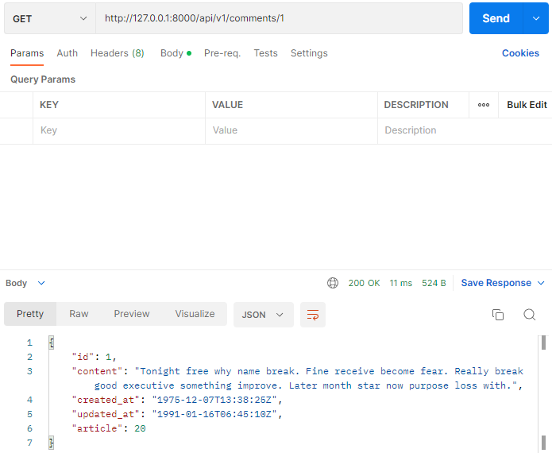

- POST - 단일 댓글 데이터 생성하기

  - 특정 게시글 안의 댓글을 작성해야 하므로 article의 정보도 필요!

  ```python
  # articles/urls.py
  ...
  urlpatterns = [
      ...
      path('articles/<int:article_pk>/comments/', views.comment_create),
  ]
  ```

  - save() 메서드는 특정 Serializer 인스턴스를 저장하는 중에 추가 데이터를 받을 수 있음, CommentSerializer를 통해 Serialize 되는 과정에서 articlepk에 해당하는 article 객체를 추가 데이터로 넘겨서 저장

  ```python
  # articles/views.py
  ...
  @api_view(['POST'])
  def comment_create(request, article_pk):
      article = Article.objects.get(pk=article_pk)
      serializer = CommentSerializer(data=request.data)
      if serializer.is_valid(raise_exception=True):
          # article 객체를 추가 데이터로 넘겨줌
          serializer.save(article=article)
          return Response(serializer.data, status=status.HTTP_201_CREATED)
  ```

  - POST /api/v1/articles/1/comments/ 를 확인하면...?

  ```
  {
      "article": [
      	"This field is required."
      ]
  }
  ```

  - 에러 이유 : CommentSerializer에서 Article Field 데이터도 사용자에게 입력 받도록 설정되어 있음.
  - read_only_fields를 사용해 외래 키 필드를 읽기 전용 필드로 설정, 해당 필드를 아예 지우는 게 아니라 정보를 읽기만 하고 전달해 주도록 함

  ```python
  # articles/serializers.py
  ...
  class CommentSerializer(serializers.ModelSerializer):
      class Meta:
          model = Comment
          fields = '__all__'
          read_only_fields = ('article',)
  ```

  - POST 응답 재확인

    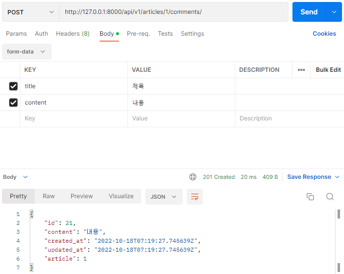

- DELETE + PUT - 댓글 데이터 삭제 및 수정 구현하기

  ```python
  # articles/views.py
  @api_view(['GET', 'DELETE', 'PUT'])
  def comment_detail(request, comment_pk):
      comment = Comment.objects.get(pk=comment_pk)
      if request.method == 'GET':
          serializer = CommentSerializer(comment)
          return Response(serializer.data)
      elif request.method == 'DELETE':
          comment.delete()
          return Response(status=status.HTTP_204_NO_CONTENT)
      elif request.method == 'PUT':
          serializer = CommentSerializer(comment, data=request.data)
          if serializer.is_valid(raise_exception=True):
              serializer.save()
              return Response(serializer.data)
  ```

  - DELETE /api/v1/comments/21/ 응답 확인

    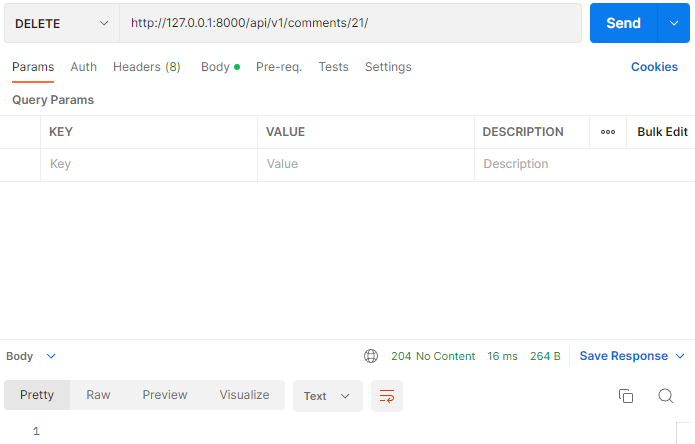

  - PUT /api/v1/comments/1/ 응답 확인

    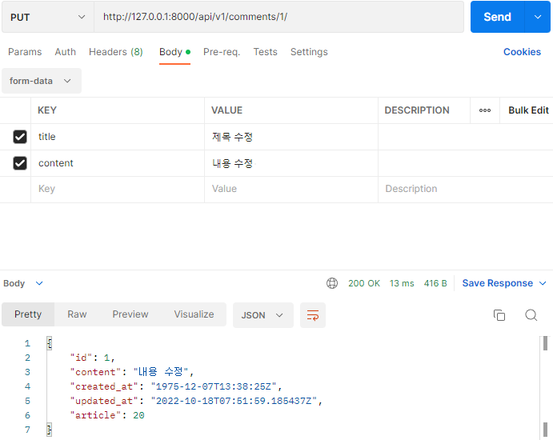

## 4-3. 역참조 데이터 조회

- 특정 게시글의 댓글 목록 출력하기 (기존 필드 override)

  - 방법 1 - PrimaryKeyRelatedField() -> 일단 써봤다가 다시 지우기... 이렇게 해서 결과물을 볼 경우 'comments' : [ 5, 8, 10, 11 ] 같은 식으로 댓글의 id 값만 나옴 

  ```python
  # articles/serializers.py
  class ArticleSerializer(serializers.ModelSerializer):
      comment_set = serializers.PrimaryKeyRelatedField(many=True, read_only=True)
      class Meta:
          model = Article
          fields = '__all__'
  ```

  ```python
  # articles/models.py
  class Comment(models.Model):
      # 역참조용 이름을 따로 지정해 줄 수 있음
      article = models.ForeignKey(Article, on_delete=models.CASCADE, related_name='comments')
      ...
  ```

  - 방법 2. Nested Relationships : 모델 관계 상 참조된 대상은 참조하는 대상과 중첩될 수 있음. 이것을 serializers를 필드로 사용하여 표현함(상하 위치 주의!)

  ```python
  # articles/serializers.py
  ...
  # Comment를 더 위로 올림.
  class CommentSerializer(serializers.ModelSerializer):
      class Meta:
          model = Comment
          fields = '__all__'
          read_only_fields = ('article',)
  
  class ArticleSerializer(serializers.ModelSerializer):
      comment_set = CommentSerializer(many=True, read_only=True)
      class Meta:
          model = Article
          fields = '__all__'
  ```

  - 응답 예시. 댓글의 내용과 정보까지 자세하게 출력 가능

    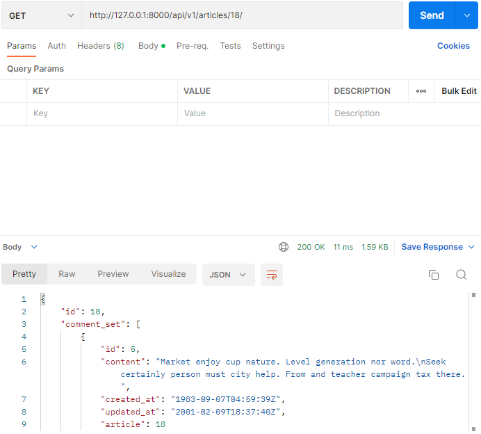

- 특정 게시글의 댓글 개수 출력하기 (새 필드 추가)

  - 게시글 조회시 그 게시글의 댓글 갯수도 함께 출력하도록 함
  - source 인자 : 필드를 채우는 데 사용할 속성의 이름, .뒤에 특정 속성을 붙여서 탐색 가능

  ```python
  # articles/serializers.py
  from rest_framework import serializers
  from .models import Article, Comment
  
  class CommentSerializer(serializers.ModelSerializer):
      class Meta:
          model = Comment
          fields = '__all__'
          read_only_fields = ('article',)
  
  class ArticleListSerializer(serializers.ModelSerializer):
      class Meta:
          model = Article
          fields = ('id', 'title', 'content',)
  
  class ArticleSerializer(serializers.ModelSerializer):
      comment_set = CommentSerializer(many=True, read_only=True)
      # source에서 .count를 사용함
      comment_count = serializers.IntegerField(source='comment_set.count', read_only=True)
      class Meta:
          model = Article
          fields = '__all__'
  ```

  - 응답 예시 : 댓글 목록 뒤에 댓글 갯수가 붙음

    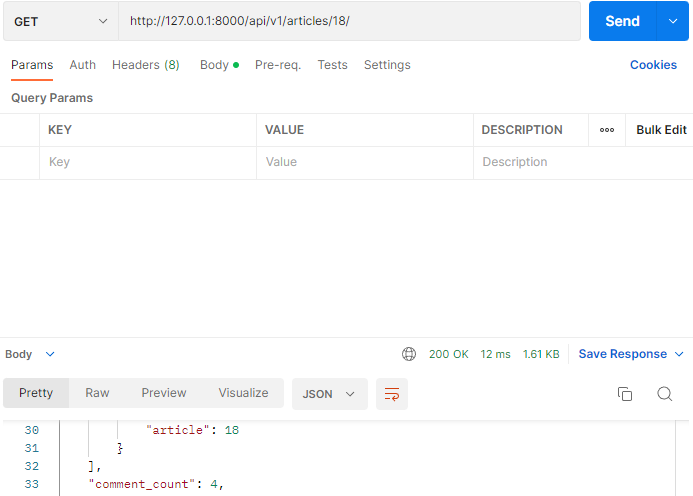

  - 주의! 이 경우처럼 특정 필드를 override한 경우 read_only_fields가 제대로 동작하지 않는다.

  ```python
  # 잘못된 예시!
  class ArticleSerializer(serializers.ModelSerializer):
      comment_set = CommentSerializer(many=True)
      comment_count = serializers.IntegerField(source='comment_set.count')
      class Meta:
          model = Article
          fields = '__all__'
          read_only_fields = ('comment_set', 'comment_count') # 이렇게 모아서 쓸 수가 없다...
  ```

## 4-4. Django Shortcuts로 에러 명확하게 해주기

- django.shortcuts 패키지는 render(), redirect(), get_object_or_404(), get_list_or_404() 등 개발에 도움되는 여러 함수와 클래스를 제공함

- get_object_or_404() - 원래는 get()을 호출하지만, 모델 객체가 없을 경우 404 에러를 raise

- get_list_or_404() - 원래는 filter()을 호출하지만, 모델 객체가 없을 경우 404 에러를 raise

- views.py에 전체 적용

  ```python
  # 먼저 이 헤더를 적용하고...
  from django.shortcuts import get_object_or_404, get_list_or_404
  
  # 기존 구문들을...
  article = Article.objects.get(pk=article_pk)
  comment = Comment.objects.get(pk=comment_pk)
  articles = Article.objects.all()
  comments = Comment.objects.all()
  
  # 전부 아래처럼 바꿈
  article = get_object_or_404(Article, pk=article_pk)
  comment = get_object_or_404(Comment, pk=comment_pk)
  articles = get_list_or_404(Article)
  comments = get_list_or_404(Comment)
  ```

  ```python
  # articles/views.py
  from rest_framework.response import Response
  from rest_framework.decorators import api_view
  from rest_framework import status
  
  from .models import Article, Comment
  from .serializers import ArticleListSerializer, ArticleSerializer, CommentSerializer
  from django.shortcuts import get_object_or_404, get_list_or_404
  
  @api_view(['GET', 'POST'])
  def article_list(request):
      if request.method == 'GET':
          articles = get_list_or_404(Article)
          serializer = ArticleListSerializer(articles, many=True)
          return Response(serializer.data)
      elif request.method == 'POST':
          serializer = ArticleSerializer(data=request.data)
          if serializer.is_valid(raise_exception=True):
              serializer.save()
              return Response(serializer.data, status=status.HTTP_201_CREATED)
          return Response(serializer.errors, status=status.HTTP_400_BAD_REQUEST)
  
  @api_view(['GET', 'DELETE', 'PUT'])
  def article_detail(request, article_pk):
      article = get_object_or_404(Article, pk=article_pk)
      if request.method == 'GET':
          serializer = ArticleSerializer(article)
          return Response(serializer.data)
      elif request.method == 'DELETE':
          article.delete()
          return Response(status=status.HTTP_204_NO_CONTENT)
      elif request.method == 'PUT':
          serializer = ArticleSerializer(article, data=request.data)
          if serializer.is_valid(raise_exception=True):
              serializer.save()
              return Response(serializer.data)
  
  @api_view(['GET'])
  def comment_list(request):
      comments = get_list_or_404(Comment)
      serializer = CommentSerializer(comments, many=True)
      return Response(serializer.data)
  
  @api_view(['GET', 'DELETE', 'PUT'])
  def comment_detail(request, comment_pk):
      comment = get_object_or_404(Comment, pk=comment_pk)
      if request.method == 'GET':
          serializer = CommentSerializer(comment)
          return Response(serializer.data)
      elif request.method == 'DELETE':
          comment.delete()
          return Response(status=status.HTTP_204_NO_CONTENT)
      elif request.method == 'PUT':
          serializer = CommentSerializer(comment, data=request.data)
          if serializer.is_valid(raise_exception=True):
              serializer.save()
              return Response(serializer.data)
  
  @api_view(['POST'])
  def comment_create(request, article_pk):
      article = get_object_or_404(Article, pk=article_pk)
      serializer = CommentSerializer(data=request.data)
      if serializer.is_valid(raise_exception=True):
          serializer.save(article=article)
          return Response(serializer.data, status=status.HTTP_201_CREATED)
  ```

  - 적용 결과. 없는 게시물을 조회하면 전에는 500 코드를 응답했지만 404로 바뀌었음 (원인 찾기 쉽겠지?)

    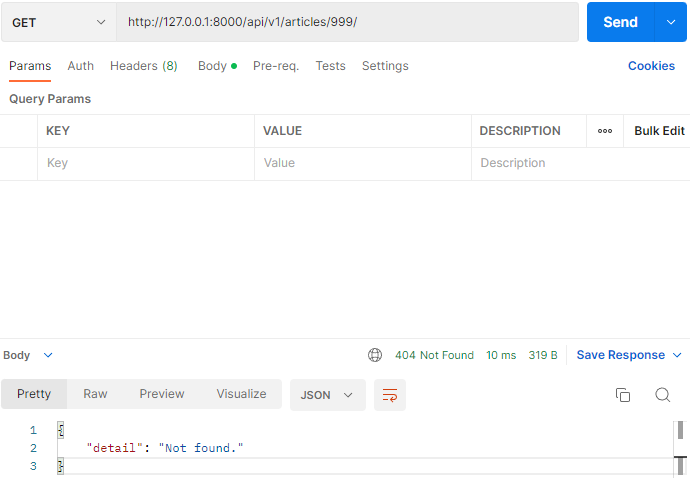