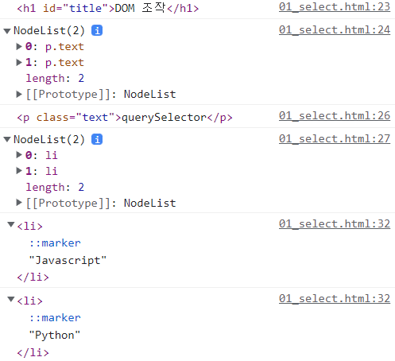
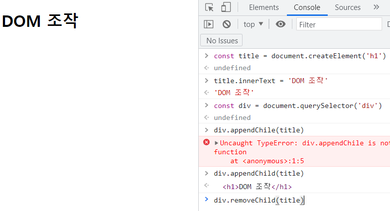

# 5. DOM

## 5-1. 브라우저에서의 JavaScript의 기능은?

- 웹 페이지에서 복잡한 기능을 구현하는 스크립트 언어
  - 스크립트 언어(Script Language)? : 응용 소프트웨어를 제어하는 컴퓨터 프로그래밍 언어
- HTML처럼 정적인 정보만 보여주는 것이 아니라 주기적으로 갱신되거나, 사용자와 상호 작용이 가능하거나, 애니메이션이 적용된 그래픽 등에 관여함

## 5-2. DOM이란?

- Browser APIs : 웹 브라우저에 내장된 API로, 현재 컴퓨터 환경에 대한 데이터를 제공하거나 여러 유용하고 복잡한 일을 수행함. => DOM, Geolocation API, WebGL 등이 있음
- DOM(Document Object Model, 문서 객체 모델)
  - **프로그래머와 브라우저의 소통을 도와주는 역할**. 문서의 구조화된 표현을 제공
  - HTML/CSS 등 각 요소를 객체로 취급하여 프로그래밍 언어로 조작할 수 있음
  - DOM은 문서를 논리 트리로 표현하며, DOM 메서드를 사용하면 프로그래밍적으로 트리에 접근하여 문서의 구조, 스타일, 컨텐츠를 변경 가능

## 5-3. DOM의 주요 객체

- DOM의 객체는 JavaScript의 객체를 뜻하는 것으로, Python의 딕셔너리와 유사함
- window object
  - DOM을 표현하는 전체화면 창이며, **가장 최상위 객체**임
  - 탭 기능이 있는 브라우저의 경우, 각 탭을 각각의 window 객체로 나타냄
  - 메서드 예시 : window.open(), window.print(), window.alert()
- document object
  - 브라우저가 불러온 웹 페이지, 주소창 아래 부분
  - 페이지 컨텐츠의 진입점이며, body 등 수많은 요소들을 포함하고 있음
  - 속성 예시 : document.title = '커스텀 창 제목'
- 파싱(Parsing)
  - 구문 분석, 해석, 브라우저가 문자열을 해석하여 DOM Tree로 만드는 과정

## 5-4. DOM 조작

- DOM 조작 순서 - 선택, 조작, 생성

- document.querySelector(), .querySelectAll() - 제공한 선택자와 일치하는 첫 번째/모든 element를 선택

  ```html
  <!DOCTYPE html>
  <html lang="en">
  <head>
    <meta charset="UTF-8">
    <meta http-equiv="X-UA-Compatible" content="IE=edge">
    <meta name="viewport" content="width=device-width, initial-scale=1.0">
    <title>Document</title>
  </head>
  <body>
    <h1 id="title">DOM 조작</h1>
    <p class="text">querySelector</p>
    <p class="text">querySelectorAll</p>
    <ul>
      <li>Javascript</li>
      <li>Python</li>
    </ul>
    <p>
  
    </p>
    <a href=""></a>
  
    <script>
      console.log(document.querySelector('#title'))
      console.log(document.querySelectorAll('.text'))
  
      console.log(document.querySelector('.text'))
      console.log(document.querySelectorAll('body > ul > li'))
      
      liTags = document.querySelectorAll('body > ul > li')
  
      liTags.forEach(element => {
        console.log(element)
      })
  
    </script>
  </body>
  </html>
  ```

  

- NodeList

  - querySelectorAll()에 의해 반환되는 NodeList는 DOM의 변경사항을 실시간으로 반영하지 X
  - index로만 각 항목에 접근 가능, 배열의 forEach 메서드 등 다양한 메서드 사용 가능

- 조작 관련 메서드(1)

  - 이하 코드들은 호이스팅(?)이 발생하는 것으로 추정되므로, **한 문구를 제외하고는 나머지는 주석 처리하여 실행시킬 것**! 혹은 아래처럼 인터넷 콘솔 창에 입력
  - document.createElement(tagName) : 작성한 tagName의 HTML 요소를 생성하여 반환
  - Node.innerText : 최종적으로 스타일링이 적용된 모습으로 표현
  - Node.appendChild(넣을 노드) : 부모 Node의 자식 Node List 중 마지막 자식으로 삽입 후 추가된 객체 반환
  - Node.removeChild(빼낼 노드) : DOM에서 자식 Node를 제거 후 제거된 Node 반환

  

  - removeChild를 실행하는 순간 웹 페이지에서 'DOM 조작'이 사라짐

- 조작 관련 메서드(2)

  - Element.getAttribute(attributeName) : 해당 요소의 지정된 값을 문자열로 반환
  - Element.setAttribute(name, value) : 지정된 요소의 값을 갱신/추가

  ```html
  <!DOCTYPE html>
  <html lang="en">
  <head>
    <meta charset="UTF-8">
    <meta http-equiv="X-UA-Compatible" content="IE=edge">
    <meta name="viewport" content="width=device-width, initial-scale=1.0">
    <title>Document</title>
    <style>
      .red { 
        color: red;
      }
      .blue {
        color: blue;
      }
    </style>
  </head>
  <body>
    <h1 class="red">안녕하세요</h1>
    <div></div>
  
    <script>
      const aTag = document.createElement('a')
      aTag.setAttribute('href', 'https://google.com')
      aTag.innerText = '구글'
  
      const divTag = document.querySelector('div')
      divTag.appendChild(aTag)
  
      const h1Tag = document.querySelector('h1')
      h1Tag.classList.toggle('blue')
    </script>
  </body>
  </html>
  ```

# 6. Event

- Event란? - 동작에 대한 반응, 클릭하면 링크를 열게 '해 줘'

## 6-1. Event 발생

- Event object : Event 발생을 알리는 객체
- 주로 addEventListener()라는 Event handler를 사용해 각 요소에 부착하게 됨
- EventTarget.addEventListener(type, listener)
  - EventTarget : 대상, Event를 지원하는 모든 객체를 지정 가능하며 전달될 때마다 함수가 호출됨
  - type : 반응할 Event 유형 (input, click, submit, ...)
  - listener : Event를 수신할 객체, 콜백 함수여야 함
  - ...하면 ...한다의 의미로 쓰임

## 6-2. Event 취소

- event.preventDefault()
  - 현재 Event의 기본 동작을 중단하고 HTML 요소의 기본 동작을 막음 (a 태그, form 태그, ...)

## 6-3. 종합 실습

- 로또 추첨기

  ```html
  <!DOCTYPE html>
  <html lang="en">
  <head>
    <meta charset="UTF-8">
    <meta http-equiv="X-UA-Compatible" content="IE=edge">
    <meta name="viewport" content="width=device-width, initial-scale=1.0">
    <title>프로젝트</title>
    <style>
      /* 스타일은 수정하지 않습니다. */
      .ball {
        width: 10rem;
        height: 10rem;
        margin: .5rem;
        border-radius: 50%;
        text-align: center;
        line-height: 10rem;
        font-size: xx-large;
        font-weight: bold;
        color: white;
      }
      .ball-container {
        display: flex;
      }
    </style>
  </head>
  <body>
    <h1>로또 추천 번호</h1>
    <button id="lotto-btn">행운 번호 받기</button>
    <div id="result"></div>
  
    <script src="https://cdn.jsdelivr.net/npm/lodash@4.17.21/lodash.min.js"></script>
    <script>
      const btn = document.querySelector('#lotto-btn')
      btn.addEventListener('click', function (event) {
  
        // 공이 들어갈 컨테이너 생성
        const ballContainer = document.createElement('div')
        ballContainer.classList.add('ball-container')
  
        // 랜덤한 숫자 6개를 만들기
        const numbers = _.sampleSize(_.range(1, 46), 6)
        console.log(numbers)
  
        // 공 만들기
        numbers.forEach((number) => {
          const ball = document.createElement('div')
          ball.innerText = number
          ball.classList.add('ball')
          ball.style.backgroundColor = 'crimson'
          ballContainer.appendChild(ball)
        })
        // 공 컨테이너는 결과 영역의 자식으로 넣기
        const resultDiv = document.querySelector('#result')
        resultDiv.appendChild(ballContainer)
      })
    </script>
  </body>
  </html>
  ]
  ```

- Create, Read 기능이 있는 Todo List (빈 칸 입력을 막는 기능이 있음)

  ```html
  <!DOCTYPE html>
  <html lang="en">
  <head>
    <meta charset="UTF-8">
    <meta http-equiv="X-UA-Compatible" content="IE=edge">
    <meta name="viewport" content="width=device-width, initial-scale=1.0">
    <title>Document</title>
  </head>
  <body>
    <form action="#">
      <input type="text" class="inputData">
      <input type="submit" value="Add">
    </form>
    <ul></ul>
  
    <script>
      const formTag = document.querySelector('form')
  
      const addTodo = function (event) {
        // console.log(event)
        event.preventDefault()
  
        const inputTag = document.querySelector('.inputData')
        const data = inputTag.value
        // console.log(data)
  
        if (data.trim()) {
          const liTag = document.createElement('li')
          liTag.innerText = data
  
          const ulTag = document.querySelector('ul')
          ulTag.appendChild(liTag)
          event.target.reset()
        } else {
          alert('내용을 입력하세요!')
        }
      }
  
      formTag.addEventListener('submit', addTodo)
    </script>
  </body>
  </html>
  ```

# 7. this (시험 문제 단골감...)

## 7-1. this 개요

- this는 **객체 자기 자신**을 가리킬 때 사용되며, python의 self는 클래스에서만 썼지만 JavaScript에서는 모든 객체에서 사용이 가능하다.
- this의 특징 : 어디서 선언되었는지 알 필요는 없고, **어디서 호출되었는지만 보면 된다**!

## 7-2. this의 사용법

- 먼저 단순 호출했을 경우에는 전역 객체를 가리킴. 브라우저의 경우 window, Node.j의 경우 global

  ```javascript
  const myFunc = function () {
      console.log(this) // window, Node.js의 경우 global
  }
  myFunc()
  ```

- 변수의 메서드로 선언하고 호출한다면, 객체의 메서드로 처리되어 **객체 자기 자신을 가리킴**

  ```javascript
  const myObj = {
    data: 1,
    myFunc() {
      console.log(this) // myObj, 콘솔 출력값 : {data:1, myFunc:f}
      console.log(this.data) // 1
    }
  }
  myObj.myFunc() // myObj
  ```

- 하지만 this로 선언된 메서드 안에서 또 this를 사용한다면, 단순 호출로 처리되어 그냥 window를 가리킴

  ```javascript
  const myObj = {
    numbers: [1],
    myFunc() {
      console.log(this) // myObj, 콘솔 출력값 : {numbers: Array(1), myFunc:f}
      this.numbers.forEach(function (number) { // 여기 있는 this는 자기 자신을 잘 가리키는데...
        console.log(number) // 1
        console.log(this) // window. 여기는 제대로 작동이 안 된다.
      })
    }
  }
  myObj.myFunc()
  ```

- 사실 화살표 함수는 이런 Nested 상황을 해결하기 위해 만들어진 것! 화살표 함수 내에서 this는 그 함수의 상위 스코프의 this를 가리키며, 따라서 **화살표 함수 구문 바로 위에서 this를 사용한 것과 동일해진다!**

  - 즉 화살표 함수의 this만큼은 호출의 위치와 관계 없이 선언한 위치에 따라 결정되게 되며, 이를 Lexical scope라고 한다.

  ```javascript
  const myObj = {
    numbers: [1],
    myFunc() {
      console.log(this) // myObj, 콘솔 출력값 : {numbers: Array(1), myFunc:f}
      this.numbers.forEach((number) => {
        console.log(number) // 1
        console.log(this) // myObj, 콘솔 출력값 : {numbers: Array(1), myFunc:f} => 위에서 this 쓰는 것과 동일!!!
      })
    }
  }
  myObj.myFunc()
  ```

- 하지만 경우에 따라서는 **function 키워드 자체가 다른 용도로 쓰일 때**가 있는데, 이 때는 화살표 함수를 쓰면 **안 된다**...

  - addEventListener의 콜백 함수는 function 키워드가 addEventListener를 호출한 대상(event.target)을 뜻하지만, 화살표 함수는 그냥 한 꺼풀 위에서 this 쓴 것과 동일해져서 window를 가리키게 됨

  ```javascript
  // 5. this와 addEventListener
  const functionButton = document.querySelector('#function')
  const arrowButton = document.querySelector('#arrow')
  
  functionButton.addEventListener('click', function(event) {
    console.log(this) // (버튼을 누를 경우) <button id="function">function</button>
  })
      
  console.log(this) // window
  arrowButton.addEventListener('click', event => {
    console.log(this) // (버튼을 누를 경우) window
  })
  ```


# Extra. 추가 노트

- CSS가 적용된 html 페이지에서 setAttribute 구문으로 스타일을 적용하려면? name = 'style', value = 'CSS 구문' 순으로 작성하면 된다!

  ```html
    <script>
      const backTheme = document.querySelector('body')
      const grayBtn = document.querySelector('li#grayButton')
      grayBtn.addEventListener('click', function() {
        backTheme.setAttribute('style', 'background-color:gray; color:white')
      })
      const whiteBtn = document.querySelector('li#whiteButton')
      whiteBtn.addEventListener('click', function() {
        backTheme.setAttribute('style', 'background-color:white; color:black')
      })
      const navyBtn = document.querySelector('li#navyButton')
      navyBtn.addEventListener('click', function() {
        backTheme.setAttribute('style', 'background-color:navy; color:white')
      })
    </script>
  ```

   